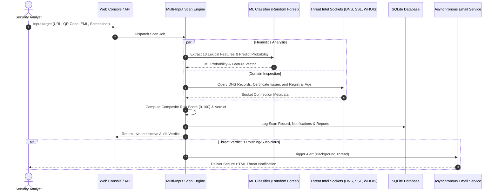

# 🛡️ AI Shield: Real-Time Phishing Detection & Threat Intelligence Platform

AI Shield is a state-of-the-art enterprise-grade Security Operations Center (SOC) platform designed to audit URLs, parse email archives (`.eml`), inspect QR codes, and run visual brand spoofing detection.

The system leverages a hybrid detection architecture: a **Random Forest Classifier** trained on 13 lexical and structural URL markers combined with socket-level domain query checkers (DNS, SSL, WHOIS) to output a composite risk rating (Legitimate, Suspicious, Phishing).

---

## 📊 System Architecture & Scan Pipeline

The scanning engine processes inputs through lexical, cryptographic, network, and visual inspection channels before storing threat metadata and notifying security analysts:



---

## 📂 Project Structure & Layout

The codebase follows professional GitHub repository layout standards, separating routing controllers, database adapters, service layers, and ML components:

```
project-root/
├── README.md                   # Developer documentation & workflow guides
├── LICENSE                     # MIT license agreement
├── .gitignore                  # Git pattern exclusions
├── requirements.txt            # System dependencies
├── Dockerfile                  # Sandbox environment definition
├── .env.example                # Sample environment configuration file
│
├── app/                        # Main application package
│   ├── routes/                 # Blueprint routing controllers
│   │   ├── __init__.py
│   │   ├── auth.py             # User authentication, registration, OTP checks
│   │   ├── main.py             # Core landing, dashboard, and history pages
│   │   ├── scanner.py          # Threat auditing endpoints (URL, QR, Email, Screenshot)
│   │   └── profile.py          # Account details, session revoker, data exports
│   │
│   ├── models/                 # DB schemas and interfaces
│   │   └── __init__.py
│   │
│   ├── services/               # Modular service layer logic
│   │   ├── dns_lookup.py       # DNS socket querying
│   │   ├── email_service.py    # SMTP asynchronous notifications
│   │   ├── report_generator.py # ReportLab PDF creator
│   │   ├── ssl_checker.py      # SSL certificate verifier
│   │   ├── threat_feed.py      # Live open feed fetching
│   │   ├── whois_lookup.py     # WHOIS metadata search
│   │   └── scanner_service.py  # Composite scan coordinator
│   │
│   ├── utils/                  # Helper modules
│   │   └── helpers.py          # Decorators, location parsers, TOTP generators
│   │
│   ├── __init__.py             # App initializer, loggers, error handling
│   └── __main__.py             # Entrypoint runner
│
├── database/                   # Database files
│   └── db_manager.py           # SQLite connection and query builder
│
├── deployment/                 # Hosting configuration files
│   └── render.yaml             # Render deployment definition
│
├── docs/                       # Technical documentations
│   └── analysis_results.md     # Platform optimization report
│
├── ml/                         # Machine learning threat classifier
│   ├── training/               # Training scripts and dataset generation
│   │   ├── prepare_datasets.py # Mock dataset builder
│   │   └── train.py            # Random Forest training script
│   │
│   ├── prediction/             # Classifier inference model
│   │   └── predict.py          # Prediction evaluator
│   │
│   ├── feature_extraction/     # Feature parsing
│   │   └── feature_extractor.py # 13 Lexical URL feature extraction
│   │
│   └── models/                 # Serialized weights & performance records
│       ├── phishing_model.pkl  # Trained classifier checkpoint
│       └── model_report.json   # Accuracy evaluation report
│
├── scripts/                    # Maintenance & utility scripts
│   ├── verify_endpoints.py     # Complete route integration tests
│   └── test_email.py           # SMTP transmission diagnostic
│
├── static/                     # User interface static assets
│   ├── css/
│   │   └── style.css           # Premium dark-mode glassmorphic interface
│   ├── js/
│   │   └── main.js             # AJAX pipelines and canvas gauge indicators
│   ├── images/                 # App logos, default avatar, and screenshots
│   ├── icons/                  # Web app icons and favicon
│   └── fonts/                  # Custom application fonts
│
├── templates/                  # Jinja2 HTML layout definitions
│   ├── base.html
│   ├── dashboard.html
│   ├── index.html
│   ├── landing.html
│   ├── login.html
│   ├── login_2fa.html
│   ├── profile.html
│   ├── register.html
│   ├── reports.html
│   └── reset_password.html
│
└── tests/
    └── test_suite.py           # PyUnit test suite
```

---

## ⚙️ Installation & Operation

### Method A: Local Setup
1. **Clone and Enter Workspace**:
   ```bash
   cd e:\Phishing
   ```
2. **Create and Activate Python Virtual Environment**:
   ```bash
   python -m venv venv
   # On Windows:
   venv\Scripts\activate
   # On Linux/macOS:
   source venv/bin/activate
   ```
3. **Install Dependencies**:
   ```bash
   pip install -r requirements.txt
   ```
4. **Compile and Train ML Model**:
   ```bash
   python ml/training/train.py
   ```
5. **Start Flask Server**:
   ```bash
   python -m app
   ```
   Open [http://localhost:5000](http://localhost:5000) in your web browser.

### Method B: Docker Container Deployment
Deploy the platform in a containerized isolation sandbox (automatically executes self-training):
```bash
# Build target image
docker build -t ai-shield .

# Launch sandbox mapping ports
docker run -p 5000:5000 ai-shield
```

---

## 📡 REST API Specifications

### 1. Dispatch Target URL Scan (`POST /scan`)
Submit indicators for real-time validation.
* **Payload**:
  ```json
  {
    "url": "http://paypal-security-alert.net/webscr"
  }
  ```
* **Response**:
  ```json
  {
    "status": "success",
    "url": "http://paypal-security-alert.net/webscr",
    "verdict": "Phishing",
    "confidence": 0.8,
    "risk_score": 80,
    "scan_time": "2026-06-14 10:35:12",
    "intelligence": {
      "whois": { "domain_age_days": 15 },
      "dns": { "has_mx": true, "has_dns": true },
      "ssl": { "has_ssl": false }
    },
    "report_download_api": "/report/download/12"
  }
  ```

### 2. Retrieve Threat Logs (`GET /history_api`)
Query recent analyst history.

### 3. PDF Incident Report (`GET /report/download/<id>`)
Generates a ReportLab threat PDF for forensics auditing.

---

## 🛡️ Security Posture & Hardening
* **Encryption standard**: Hashed analyst credentials using PBKDF2 with SHA-256.
* **Session Integrity**: Session hijacking defense using rotation and locked 2FA states.
* **API Protection**: CSRF protection tokens enforced on all POST/PUT/DELETE forms.
* **Network Restrictions**: Injection defenses via parameterized SQLite queries and Flask-Limiter brute-force rate-limiting.
