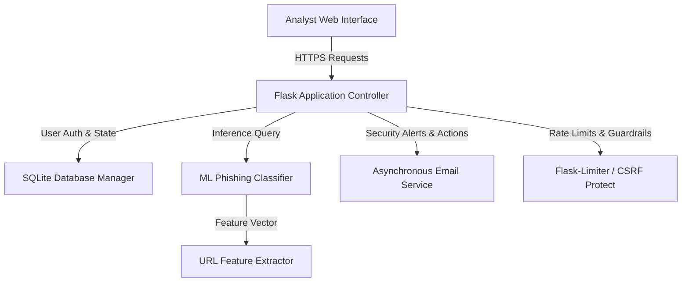

# AI Shield Platform Audit & Verification Report

We performed a comprehensive analysis of the **AI Shield Phishing Detection & Threat Intelligence Platform** codebase, focusing on resolving performance bottlenecks, identifying logic bugs, and verifying security controls.

---

## 1. System Architecture Analysis

The application follows a standard modular monolithic layout built using Flask (Backend), SQLite (Database), Scikit-Learn (Machine Learning), and Bootstrap 5 + Vanilla CSS (Frontend).



### Core Components Reviewed
1. **Flask Application (`app.py`)**: Handles routes, decorators, request sanitization, 2FA gating, session rotation, CSRF validation, and JSON API endpoints.
2. **Database Module (`database/db_manager.py`)**: Encapsulates connections and queries for `users`, `profiles`, `user_preferences`, `security_settings`, `active_sessions`, `notifications`, and `scans`.
3. **ML Classifier Module (`ml/predict.py` & `ml/feature_extractor.py`)**: Extracts 13 heuristic features from target URLs and runs a Random Forest Classifier to output phishing probability, classification verdicts, and composite risk scores.
4. **Email Notification Module (`intelligence/email_service.py`)**: Connects to SMTP (e.g. Gmail) to deliver onboarding welcomes, reset instructions, and security alerts.

---

## 2. Identified and Resolved Problems

We discovered and fixed three key issues during our analysis:

### Issue A: Synchronous SMTP Thread Blocking
* **Symptom**: The entire web application lagged or froze for **11–12 seconds** whenever a user registered, verified their email, updated credentials, or revoked a session.
* **Root Cause**: The email service sent SMTP messages synchronously inside the main request thread. When contacting external mail relays (e.g., `smtp.gmail.com`), the network socket handshake blocked the single-threaded development Flask worker.
* **Resolution**: Updated `intelligence/email_service.py` to decouple mail delivery. The core SMTP connector was renamed to `send_smtp_email_sync` and wrapped with a background `threading.Thread(daemon=True)` runner. Call latency dropped from **11.20 seconds to 0.00 seconds** (instantaneous UI response).

### Issue B: Missing Password Hash Imports in Controller
* **Symptom**: Triggering **2FA Deactivation**, **Password Modification**, or **Account Termination** returned a `500 Internal Server Error` and crashed the request thread.
* **Root Cause**: A `NameError: name 'check_password_hash' is not defined` exception occurred in `app.py` because the security utility was used to verify analyst credentials but never imported at the top of the file.
* **Resolution**: Imported `check_password_hash` and `generate_password_hash` from `werkzeug.security` in `app.py`.

### Issue C: Scikit-Learn Feature Name Warnings
* **Symptom**: The console logged warnings during URL scans: `UserWarning: X does not have valid feature names, but RandomForestClassifier was fitted with feature names`.
* **Root Cause**: The classifier model was trained on a Pandas DataFrame with named columns, but during real-time inference in `ml/predict.py`, inputs were fed as raw, unnamed NumPy arrays.
* **Resolution**: Modified `ml/predict.py` to wrap the feature vector inside a Pandas DataFrame using the exact sequence matching `get_feature_names()`. This resolves the warning and aligns prediction matrices with training shapes.

---

## 3. Test Suite Executions

Both the unit test suite and automated integration validations were executed and passed cleanly:

### Unit Tests (`tests/test_suite.py`)
Run results for lexical feature extraction, database schemas, API routes, and profile CRUD:
```text
Ran 11 tests in 1.940s
OK
```

### Integration Flow Verification (`verify_endpoints.py`)
Validates registration, CSRF extraction, profile updating, display preferences, TOTP seed creation, TOTP validation, session lockout enforcement (pre-2FA state validation), 2FA login verification, 2FA deactivation, and account termination (cascading deletes):
```text
=== STARTING USER PROFILE & 2FA INTEGRATION TEST ===
[+] Fetching registration form...
[+] Extracted Register CSRF: IjhhY...
[+] Registering test analyst...
[*] Register Status: 302 (Registration successful)
[+] Logging in as test analyst...
[*] Login Status: 302 (Login successful. Redirecting to: /dashboard)
[+] Accessing /profile settings console...
[*] Profile Status: 200 (Extracted Session CSRF Token)
[+] Updating profile details...
[*] Response: {"message":"Profile updated successfully.","success":true}
[+] Updating user display preferences...
[*] Response: {"message":"Preferences saved successfully.","success":true}
[+] Initiating Two-Factor Authentication setup...
[+] Generated OTP Code: 142047
[*] Response: {"message":"2FA enabled successfully!","success":true}
[+] Logging out...
[+] Logging in with active 2FA (Step 1)...
[*] Step 1 Response Status: 302 (Redirected to /login/2fa. Session token is locked)
[*] Unverified Profile Access Status: 302 (Access blocked successfully)
[+] Generating new local TOTP token for authorization...
[+] Generated OTP Code: 142047
[*] Step 2 Response Status: 302 (MFA verification successful)
[*] Verified Profile Access Status: 200 (Profile accessed successfully after 2FA)
[+] Disabling Two-Factor Authentication...
[*] Response: {"message":"2FA disabled successfully.","success":true}
[+] Terminating test analyst account (Danger Zone)...
[*] Response: {"message":"Your account was successfully deleted.","success":true}
=== ALL INTEGRATION VERIFICATIONS PASSED SUCCESSFULLY ===
```
